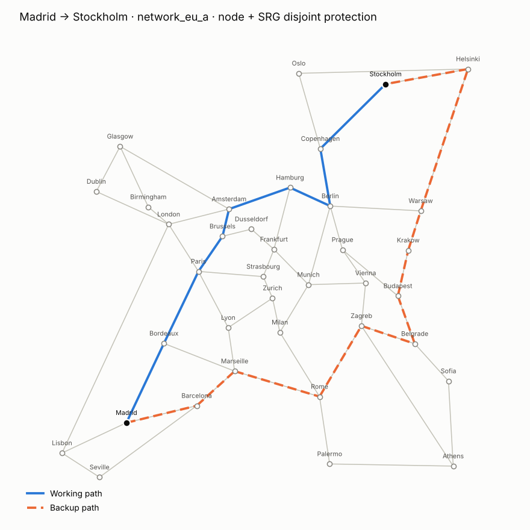
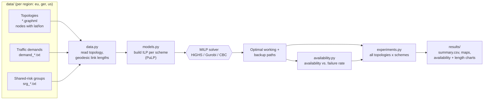
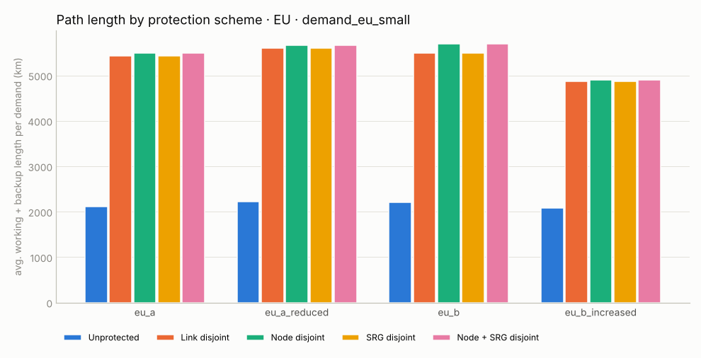
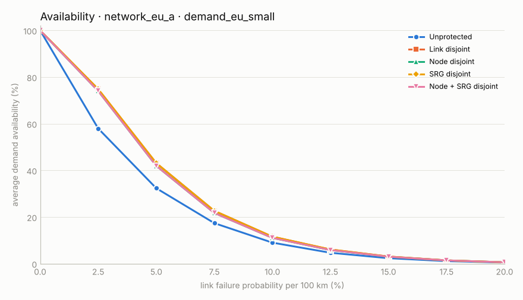

# Resilient Routing in Optical Core Networks

**How much fibre does it cost to make a backbone network survive failures, and what does it buy?**

This project computes *optimal* working and backup paths for traffic demands in
European, German and US optical core networks using **integer linear programming (ILP)**,
compares five protection schemes, and evaluates the resulting **availability** under
link failures.



*Example: the cheapest pair of paths from Madrid to Stockholm whose working path (blue)
and backup path (orange) share no link, no intermediate node and no shared-risk group.*

## Protection schemes

| Scheme | Working and backup path must not share ... | Survives |
|---|---|---|
| **Unprotected** | – (single shortest path) | nothing |
| **Link disjoint** | any link | any single fibre cut |
| **Node disjoint** | any link or intermediate node | a fibre cut or a node (site) failure |
| **SRG disjoint** | any link or *shared-risk group* | a cut of several fibres in the same duct/bridge |
| **Node + SRG disjoint** | links, intermediate nodes, SRGs | all of the above |

A **shared-risk group (SRG)** is a set of links or nodes that can fail together, e.g.
two "different" fibres laid in the same trench. Being link-disjoint on paper does not
help if both paths go through that trench, and SRG-disjoint routing captures that.

## ILP formulation

For every demand $r=(s_r,t_r)$ and every directed arc $(i,j)$ with length $\ell_{ij}$ (km):

$$u^r_{ij},\ v^r_{ij} \in \{0,1\}\quad\text{(arc used by the working / backup path of } r\text{)}$$

$$\min \sum_r \sum_{(i,j)} \ell_{ij}\,\big(u^r_{ij} + v^r_{ij}\big)$$

subject to

* **flow conservation** (one unit from $s_r$ to $t_r$, for $u$ and for $v$):
  $\sum_i u^r_{in} - \sum_j u^r_{nj} = \begin{cases}-1 & n=s_r\\ 1 & n=t_r\\ 0 & \text{otherwise}\end{cases}$
* **link disjoint**: $u^r_{ij}+u^r_{ji}+v^r_{ij}+v^r_{ji} \le 1$ for every link $\{i,j\}$
* **node disjoint**: $\sum_j \big(u^r_{nj}+v^r_{nj}\big) \le 1$ for every transit node $n$
* **SRG disjoint**: with indicator variables $w^r_g, b^r_g$ ("working/backup touches group $g$"),
  $w^r_g \ge u^r_{ij}$, $b^r_g \ge v^r_{ij}$ for every arc of $g$, and $w^r_g + b^r_g \le 1$

The unprotected case uses only $u$ and flow conservation (a shortest-path ILP).

**Availability model.** Each link fails with probability $p\cdot\ell/100$ ($p$ = failure
probability per 100 km). A path is available if all its links are up; a protected demand
is available if its working *or* its backup path is up:

$$A_\text{path}=\prod_{(i,j)\in\text{path}}\Big(1-p\,\tfrac{\ell_{ij}}{100}\Big),\qquad
A_\text{demand}=1-(1-A_\text{work})(1-A_\text{backup})$$

## Architecture



## Results (European networks, demand set `demand_eu_small`)

Average **working + backup** length per demand, and average availability at a failure
probability of 2.5 % per 100 km:

| Scheme | eu_a | eu_a_reduced | eu_b | eu_b_increased |
|---|---|---|---|---|
| Unprotected | 2,110 km · 58.0 % | 2,216 km · 56.7 % | 2,202 km · 56.9 % | 2,077 km · 58.5 % |
| Link disjoint | 5,433 km · 74.8 % | 5,606 km · 73.0 % | 5,486 km · 74.2 % | 4,868 km · 77.4 % |
| Node disjoint | 5,486 km · 74.0 % | 5,659 km · 73.0 % | 5,700 km · 72.6 % | 4,906 km · 77.1 % |
| SRG disjoint | 5,433 km · 74.8 % | 5,606 km · 73.8 % | 5,486 km · 74.2 % | 4,868 km · 77.6 % |
| Node + SRG disjoint | 5,486 km · 74.0 % | 5,659 km · 73.0 % | 5,700 km · 72.6 % | 4,906 km · 77.1 % |





**Takeaways**

* **Protection costs 2.3-2.6x the fibre**: every protected scheme adds a second path,
  and it is longer than the shortest one.
* **Protection lifts availability by 16-19 percentage points** at a failure probability
  of 2.5 % per 100 km (10-13 points at 5 %). The gain shrinks at high failure rates,
  because continental paths of 2,000+ km are then likely to fail on *both* routes.
* **Stricter protection is almost free here**: node-disjoint routing costs only 1-4 %
  more length than link-disjoint routing, with nearly the same availability (the four
  protected curves above almost overlap). The three European SRGs never added any
  length: there was always an equally short pair of paths that avoids them.
* **Topology matters more than the scheme**: adding links (`eu_b_increased`) shortens
  protected routes by ~11 % and gives the highest availability, while removing links
  (`*_reduced`) does the opposite.

## Quick start

```bash
python -m venv .venv && source .venv/bin/activate     # Windows: .venv\Scripts\activate
pip install -r requirements.txt pytest

python -m pytest                                       # 7 tests, < 2 s
PYTHONPATH=src python -m resilience --region eu        # also: --region ger | us
#   --demand demand_eu_big   (other demand sets in data/<region>/)
```

Outputs go to `results/<region>_<demand>/`: `summary.csv` (lengths and availability
for every topology x scheme), route maps, availability curves and the path-length chart.
The whole European study (4 topologies x 5 schemes) solves in a few seconds.

The ILPs are solved with the open-source **HiGHS** solver by default; if Gurobi or CBC
is installed, PuLP can use those instead.

## Data

| Region | Topologies (nodes / links) | SRGs |
|---|---|---|
| `eu` | `network_eu_a` (37/57), `_a_reduced` (37/54), `network_eu_b` (28/41), `_b_increased` (28/45) | 3 link groups |
| `ger` | `network_ger_a` (50/88), `_a_reduced` (50/77), `network_ger_b` (17/26), `_b_increased` (17/30) | 3 node groups |
| `us` | `network_us_a` (26/42), `_a_reduced` (26/36), `network_us_b` (14/21), `_b_reduced` (14/18) | – |

Each region has four demand sets (`small`, `medium`, `big`, `uniform`) with the same
six source/destination pairs and different capacities. The routing models are
capacity-independent (no link-capacity limits), so all four give the same routes.

## Project history

This started as a university project at TU München in 2017, written in Python 2
with the commercial **Gurobi** solver. That original code is kept unchanged in
[`original/`](original/). The `src/` package is a 2026 rewrite that:

* runs on Python 3 with current NetworkX, geopy and PuLP + HiGHS (free, no licence needed);
* uses each link's own geodesic length as its cost (the original used the shortest-path
  distance between the link's end nodes, which differs where a detour is shorter);
* adds node-based SRGs (used by the German data set) next to link-based SRGs;
* replaces pairwise SRG constraints with indicator variables, which works for groups
  of any size;
* adds tests, a command-line interface, CSV output and redrawn figures.

## Project layout

```
src/resilience/
  data.py           topologies (GraphML), demands, shared-risk groups, link lengths
  models.py         ILP models for the five protection schemes
  availability.py   availability model
  experiments.py    run all topologies x schemes, write CSV + figures
  plots.py          route maps, availability curves, path-length chart
data/{eu,ger,us}/   topologies, demand sets, SRG definitions
original/           2017 Python 2 + Gurobi code (unchanged) and its figures
tests/              pytest suite (small hand-checkable networks + a real topology)
docs/figures/       figures used in this README
```

## Tech

Python · integer linear programming (PuLP, HiGHS; originally Gurobi) · NetworkX ·
geopy · matplotlib · GitHub Actions
